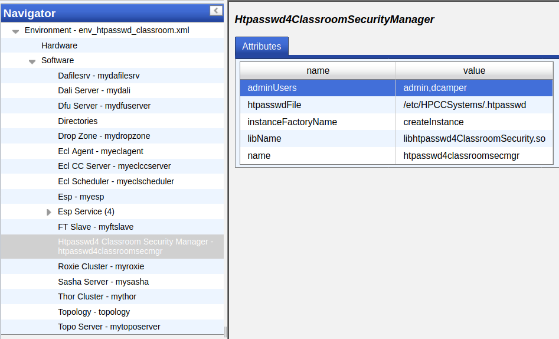
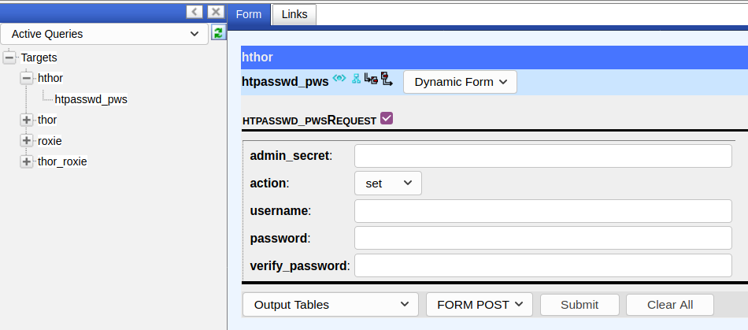
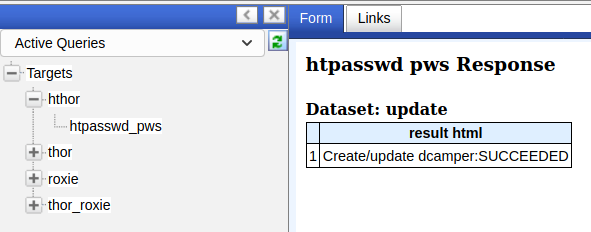
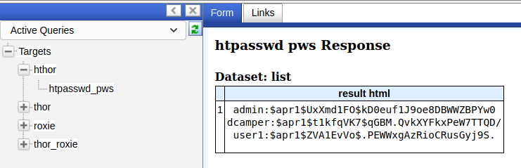
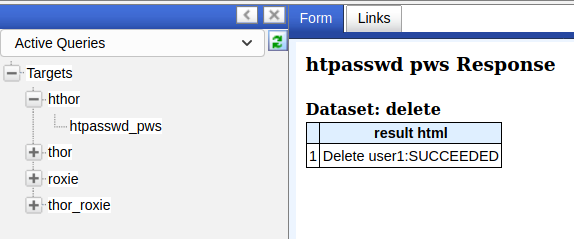

# HTPASSWD for Classrooms

Copyright (C) 2021 HPCC Systems

## What Is This

This project builds a security manager plugin for the HPCC Systems big data platform.  See [https://hpccsystems.com](https://hpccsystems.com) for more information.  Source code for the platform can be found at [https://github.com/hpcc-systems/HPCC-Platform](https://github.com/hpcc-systems/HPCC-Platform).

## Compatibility

This plugin requires HPCC Systems platform version 7.12.0 or later.

## Motivation

Classroom settings that involve grading the students' work should not allow easy cheating.  Unfortunately, a wide-open HPCC Systems cluster is exactly that, unless user authorization is enabled.  A student can use ECL Watch to look at another student's workunit and therefore the workunit's code, then do with it what they will.

There are two security manager plugins for the HPCC Systems cluster that provide both authentication and authorization:

- LDAP:  Requires a separate LDAP server and is relatively complicated to set up.  If an LDAP server is already available then this is perhaps a good solution.  If not, then standing one up and managing it just for a classroom is probably overkill.
- JWT:  A plugin that uses bearer tokens to provide authorization rights.  It also requires a separate server to manage the users and their authorizations.  While probably simpler than LDAP, it is still a lot of work.

The above plugins are really overkill if the only thing we're trying to do is prevent a student from accessing another student's workunit.

## Solution

The HPCC Systems cluster provides an authentication-only plugin that leverages Apache's htpasswd scheme.  We decided to modify that plugin so that it also enforces the workunit restriction we need while leaving everything else wide open.  This is a solution with a very narrow use case, so this plugin is not generally available, but it _is_ very simple.

## Prebuilt Plugins

Some plugins have been built for you and reside in this repo.  Check in the [prebuilt_packages](prebuilt_packages) subdirectory.  To date, there has been no concerted effort to build plugins for every platform version or every supported operating system.  It's more of an opportunistic thing.  If you want to see a plugin prebuilt and put here, send an email to dan.camper@lexisnexisrisk.com.

The format of the filenames is:

    htpasswd4ClassroomSecurity_hpcc_<v1>_plugin_<v2>_<platform>.<package_suffix>

Where:

* v1: The version of the HPCC Systems platform for which this plugin is built.
* v2: The version of this plugin.
* platform: The name of the operating system for which this plugin is built.  My Ubuntu 20.04 system shows this as 'focal_amd64' for example.
* package_suffix: .deb for Debian or .rpm for CentOS.

## Building the Plugin

This plugin requires access to the HPCC Systems source code, found on GitHub at [https://github.com/hpcc-systems/HPCC-Platform](https://github.com/hpcc-systems/HPCC-Platform).  While it is not strictly required that you build the platform, you do need to make sure you have quite a bit of the dependencies fulfilled so the plugin builds without a hitch.  The easiest way to do that is to actually build the platform.  See the "Build From Source" link in the README there.

When you build the plugin, it is **very important** that you match the platform's source code version with the version of the running cluster on which you will be installing this plugin (or at least the major.minor version parts, like 7.12).  Checkout the correct git branch in the platform's code base.  Also, make sure you're building the plugin against the same operating system as what your running cluster is using.

This plugin's code is built out-of-source, so we'll need to create a directory in which to build the plugin.  The following assumes this directory structure (~ means your home directory):

    ~/
        HPCC-Plugin/                          <- our build directory
        Projects/
            HPCC-Platform/                    <- HPCC platform source code
            HPCC-htpasswd4classroom/          <- this plugin's source code

Build steps:

    cd ~/HPCC-Plugin
    cmake -DHPCC_SOURCE_DIR=~/Projects/HPCC-Platform ~/Projects/HPCC-htpasswd4classroom
    make
    make package

At this point you will have a .rpm or .deb installation package that you can install onto your cluster.  The package will have a name like `htpasswd4ClassroomSecurity_1.0.0_focal_amd64.deb` (this was built on an Ubuntu 20.04 system).

## Cluster Requirements

Make sure the htpasswd utility is installed on the HPCC Systems node that runs the esp process (the one you connect to for ECL Watch).  This is usually not a stand-alone utility; you need to install the `apache2-utils` package instead, and htpassword is part of that.  Use either apt (Debian) or yum (CentOS) to perform that installation.

## Installing the Plugin

Installation is straightforward:  Copy the package file you just build to the HPCC node running the esp process (this is typically the one you connect to with ECL Watch) and install it using whatever tool you use to install packages.  On the command line, that would be either dpkg (Debian) or yum (CentOS), but you could also use a GUI application if you wish.

## Configuring the Plugin

This plugin is configured basically the same as the htpasswd plugin that is included with the HPCC platform code.  There are two differences, outlined below.  Instructions for configuring the built-in htpasswd plugin can be found at [https://hpccsystems.com/training/documentation/all](https://hpccsystems.com/training/documentation/all), in the "HPCC Systems Administrator's Guide" document.  Within that document, search for "Using htpasswd authentication" and you will find the configuration instructions.

The first difference between configuring the built-in plugin and this one is the name of the plugin you choose in the various popup lists.  Instead of selecting "Htpasswdsecmgr" you should select "Htpasswd4Classroomsecmgr".  Both will be available in some places, so make sure you choose the right one.

The only other change is a new addition to this classroom plugin:  You can specify the usernames of the users that should be considered administrators of the cluster.  The administrators do not have the workunit restriction imposed on them; they can see all workunits.  In configmgr, when you configure the plugin itself, there is a field labeled "adminUsers" -- that is where you define those administrator users.  The username "admin" is populated by default.  To add more usernames, just edit the field and use a comma to separate the usernames.  If you submit an empty field then the username "admin" will be added to the internal list at runtime.

Here is a screenshot showing two admin users defined, "admin" and "dcamper":

## Configuring Users Via the Command Line

You should define at least one of the administrator's usernames and passwords in the .htpasswd file before you restart the cluster.  Use `man htpasswd` on the command line to see all of the options and to obtain an overview of what the utility does.

If you used the recommended default configuration for plugin, you do not have an existing .htpasswd file, and you want to define the username "admin" then steps would be:

    cd /etc/HPCCSystems
    sudo htpasswd -c .htpasswd admin

If already have an existing .htpasswd file, omit the `-c` argument.  This example also assumes your file is at `/etc/HPCCSystems/.htpasswd` which is the recommended default location for this file.

To add other users, such as other administrators or students, use the same technique as with the admin user above.  Be sure to omit the `-c` argument though, or you will be constantly truncating your .htpasswd file.

Here is a sample session for creating the users and passwords for our two admin users:

    campda01@ubuntu-20-04:/etc/HPCCSystems $ sudo htpasswd -c .htpasswd admin
    New password:
    Re-type new password:
    Adding password for user admin

    campda01@ubuntu-20-04:/etc/HPCCSystems $ ls -al .htpasswd
    -rw-r--r-- 1 hpcc hpcc 44 Mar 15 13:35 .htpasswd

    campda01@ubuntu-20-04:/etc/HPCCSystems $ cat .htpasswd
    admin:$apr1$UxXmd1FO$kD0euf1J9oe8DBWWZBPYw0

    campda01@ubuntu-20-04:/etc/HPCCSystems $ sudo htpasswd .htpasswd dcamper
    New password:
    Re-type new password:
    Adding password for user dcamper

    campda01@ubuntu-20-04:/etc/HPCCSystems $ ls -al .htpasswd
    -rw-r--r-- 1 hpcc hpcc 90 Mar 15 13:35 .htpasswd

    campda01@ubuntu-20-04:/etc/HPCCSystems $ cat .htpasswd
    admin:$apr1$UxXmd1FO$kD0euf1J9oe8DBWWZBPYw0
    dcamper:$apr1$E8l.uC6S$LfB56u10UzTUFEcSmBpv1.

Within the .htpasswd file, there is no difference between admin and regular users.  This file is for authentication only.  Authorization -- who can do what -- is handled by the plugin.

Note that changes made to the .htpasswd file take effect immediately, even for a running cluster.

## Configuring Users Via the hthor-based Helper

Included with this plugin is [an ECL file](ECL/query_htpasswd_admin.ecl) that can be used to provide an API of sorts for user management.  That code is intended to become an hthor query, which is something of an oddity in the HPCC Systems world.  The reason for using hthor over, say, ROXIE, is that it is far more likely that hthor will share system resources with the esp process, which in turn is probably sharing the storage space where your .htpasswd file lives.  Since the ECL code issues commands to the htpasswd binary, it needs access to both the binary and the password file.

This file should be customized for your installation.  The following is an excerpt from the beginning of the file:

    // The secret value someone must enter on the query form in order to successfully
    // modify the user file; can be empty but, if it is, anyone will be able to make
    // changes and that is probably a Bad Thing
    SECRET_VALUE := 'Secret123';

    // The full path to the htpasswd binary application
    HTPASSWD_BIN := '/usr/bin/htpasswd';

    // The full path to the htpasswd user file; this must match the file entered in
    // the HPCC Systems configmgr configuration screen
    HTPASSWD_FILE_PATH := '/etc/HPCCSystems/.htpasswd';

Once you modify the constants to your satisfaction, you should compile the file on hthor and then publish the workunit.  The query name will be `htpasswd_pws`.  If you go to the ROXIE page on your cluster (e.g. http://localhost:8002/) and select the query, you should see something like this:

Every query submission requires you to reenter the `admin_secret` (the value of SECRET_VALUE from the ECL code).

There are three possible actions:

* set:  Create or update one or more users.
* delete: Delete one or more users.
* list: Show the contents of the .htpasswd file.

The `username` field must be filled in when `action` is either `set` or `delete`.  You can operate on more than one username at the same time by separating the usernames with commas.

If `action` is `set` then the password fields come into play.  To set an explicit password for a user, enter that password.  If more than one username is put into the `username` field then all of those users will acquire the same password.  If you leave both password fields empty, the ECL code will generate a random password for each username.

_**Note regarding password generation:**  A generated password is two 3-6 character words separated by a random punctuation mark.  The words are chosen from the system's dictionary file, provided with all Linux distributions.  That word list is not culled for so-called naughty words.  The ECL code does make an attempt to remove naughty words from the list, but no one has exhaustively reviewed all of the possible words to ensure that they were all caught.  In addition, seemingly-innocent words, when concatenated with a punctuation symbol, could acquire a new meaning that may not be desirable.  It is strongly recommended that you review random passwords for suitability.  If you find something that is questionable, you can always redo that user's entry using this code._

You can view the contents of the .htpasswd file (useful primarily to ensure that all the usernames you need are present).

Deleting a user does not require their password; only their username is required.

All ROXIE and hthor queries can also be accessed via JSON REST calls.  Basically, all the fields shown above become query parameters in the URL.  Example:

    curl 'localhost:8002/WsEcl/submit/query/hthor/htpasswd_pws/json?admin_secret=Secret123&action=set&username=user1&password=MyNewPassword&verify_password=MyNewPassword'
    {"htpasswd_pwsResponse": {
    "Results": {
     "update": {"Row": [
       {"result__html": "Create/update user1:SUCCEEDED"}]}}}}

Note that you may need to supply a valid basic authorization header in your request if the system has an active authentication system (like what this plugin provides).

Changes made to the .htpasswd file through this code take immediate effect.

## HPCC Cluster After Plugin Installation

There are only a few changes from a "standard" HPCC usage:

* All users will have to authenticate with a username and password.
* Regular users will not be able to view other users' workunits.
* Only the admin users can view all workunits.
* All other permissions remain the same as with a cluster not running any security policies (i.e. wide open).
